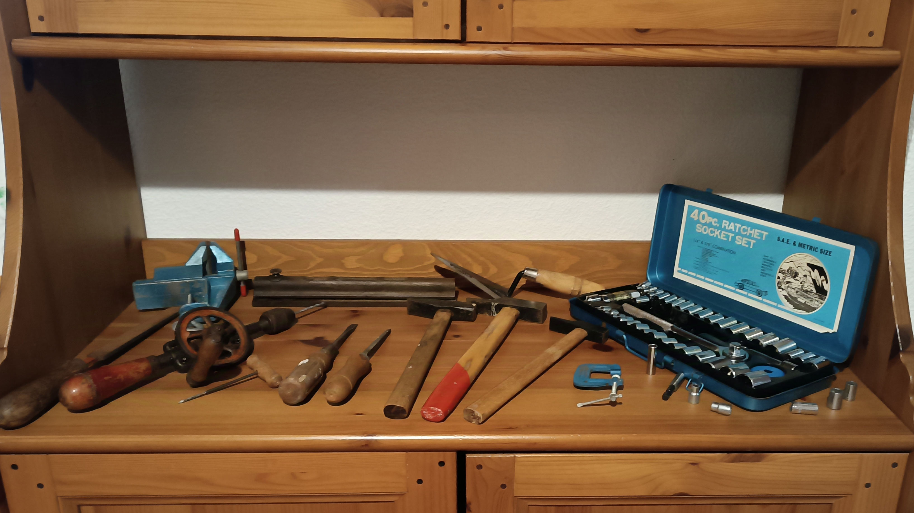

# Sobre mí
Hola!
Actualmente soy un estudiante que intenta llegar a ser ingeniero mecánico, aunque ya he hecho algunos proyectos pequeños y sencillos como hobby (entre ellos algún encargo especial por mi colegio). Aquí comparto algunas ideas personales y otras cosas.

---

## Mi opinión sobre la "electrificación"
Los problemas como la descarbonización del transporte rara vez se resuelven con una política universal, y por eso los combustibles sintéticos están surgiendo como una parte necesaria del futuro de la movilidad. Depender únicamente de los vehículos eléctricos implica confiar en una tecnología inmadura, una estrategia que la historia muestra que puede salir mal, como se vio a principios de los 2000, cuando la legislación y regulación de la UE favorecían fuertemente a los vehículos diésel de pasajeros. En menos de dos décadas quedó claro cómo esa legislación fracasó finalmente y cómo los diésel no eran tan amigables con el medio ambiente y el CO₂ como las investigaciones iniciales nos habían hecho creer.

Los combustibles líquidos sintéticos se producen utilizando hidrógeno de energía renovable y CO₂, que puede extraerse directamente del aire mediante tecnologías como <a href="https://newsroom.porsche.com/en/2023/sustainability/porsche-direct-air-capture-iaa-fighting-climate-change-with-important-new-technology-33646.html" target="_blank" rel="noopener noreferrer">Captura Directa de Aire (DAC)</a>. Esta tecnología se considera importante para el futuro de la extracción de energía y la acción climática. Este CO₂ se puede extraer en cualquier lugar donde haya energía renovable disponible para alimentar el proceso, y la tecnología es escalable. Al usar combustibles sintéticos, los vehículos de motor de combustión interna (ICE) existentes, de los cuales todavía habrá muchos en circulación durante décadas, pueden funcionar de manera casi neutra en carbono. Esto significa que los combustibles sintéticos ofrecen una vía para incluir vehículos más antiguos en el esfuerzo de descarbonización. En sus propiedades fundamentales, estos combustibles no son diferentes de la gasolina o el diésel hechos a partir de petróleo, lo que facilita su distribución usando la infraestructura existente. Ya estamos viendo esto: Porsche y sus asociados ya producen combustible sintético industrialmente en Chile desde finales de 2022, aprovechando la fuerte energía eólica local para producir combustibles sintéticos.

Si imponemos un cambio rápido únicamente hacia vehículos eléctricos de batería (EV), corremos el riesgo de cambiar el problema climático actual por dos nuevos: electricidad que no es tan limpia como se pensaba y una enorme cantidad de residuos. Aunque los EV tienen muchos beneficios, la tecnología sigue siendo primitiva comparada con más de un siglo de desarrollo invertido en la tecnología de combustión. Además, la producción de las baterías por sí sola genera un gran daño ambiental incluso antes de que el vehículo salga a la carretera. Por ejemplo, el proceso de fabricación (especialmente la energía usada en la etapa de ensamblaje) es una parte importante del efecto total de gases de efecto invernadero, contribuyendo entre el 45% y el 60% del impacto de producción. Por eso, la mezcla de electricidad del lugar de producción afecta significativamente el resultado final. A pesar de las emisiones, las baterías de iones de litio generan riesgos de seguridad, ya que si fallan, la energía almacenada puede liberarse casi instantáneamente, causando un calentamiento severo que podría provocar un incendio o una explosión. Apagar estos incendios en baterías de vehículos, que contienen miles de celdas, es extremadamente difícil, a veces requiriendo sumergir todo el paquete en agua, lo cual suele ser casi imposible en los más grandes. La tasa de fallas se considera "muy rara", reportándose como un incendio por cada millón de baterías. En estándares de ingeniería, esta tasa se considera un "buen sistema", pero considerando los millones de vehículos que tendrían que ser reemplazados, el riesgo crece exponencialmente.

Esto nos lleva al reciclaje de estas baterías. Actualmente no existe un mercado para baterías de vehículos reacondicionadas o de "segunda vida", lo que significa que todo el impacto ambiental de la producción de la batería recae en el vehículo mismo. Reciclar baterías de iones de litio es técnicamente difícil, pero el mayor problema suele ser económico. Por ejemplo, tipos de baterías como las de Fosfato de Hierro y Litio (LFP) carecen de metales económicamente valiosos como cobalto o níquel, que suelen impulsar el proceso de reciclaje comercial, lo que significa que hay poco incentivo para recuperar otros materiales importantes como aluminio o litio. Los materiales recuperados generalmente no son de "calidad para baterías", lo que significa que no se pueden reutilizar en nuevas baterías y deben descomponerse en elementos, añadiendo más pasos y costos al proceso.

Debido a estos problemas de fabricación, preocupaciones de seguridad y dificultad en la recuperación de materiales, los combustibles sintéticos ofrecen una alternativa sólida a este problema. Brindan una solución inmediata y viable para descarbonizar la flota de transporte que existe hoy y para aquellos vehículos, como barcos y aviones, donde las baterías simplemente no son una solución práctica por ahora. Al apoyar tanto opciones eléctricas como combustibles líquidos sostenibles, adoptamos la transición orgánica y sensata que es necesaria para la sostenibilidad a largo plazo. Por lo tanto, los vehículos eléctricos de batería no deberían verse como un reemplazo del sistema actual; más bien, deberían considerarse una alternativa.

---

## Colección de herramientas antiguas
Una tarde, mi abuelo me enseñó su colección de herramientas antiguas y me dijo que quería que las preservara, explicándome que algunas de ellas datan de hasta cuatro generaciones antes que yo, lo que las convierte en una pieza fascinante y significativa de la historia familiar que me enorgullece continuar.

 

 
