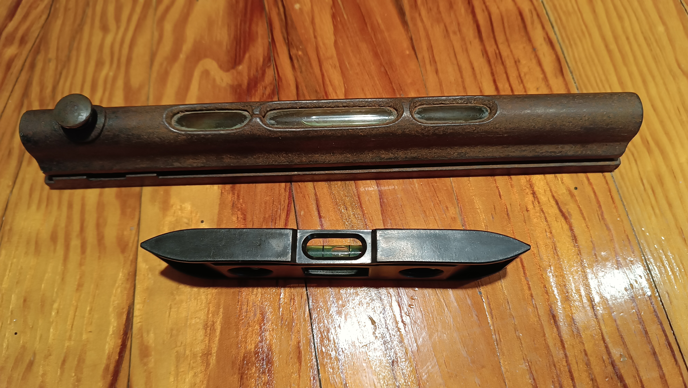

# Sobre mí
Hola!
Actualmente soy un estudiante que intenta llegar a ser ingeniero mecánico, aunque ya he hecho algunos proyectos pequeños y sencillos como hobby (entre ellos algún encargo especial por mi colegio). Aquí comparto algunas ideas personales y otras cosas.

---

## Colección de herramientas antiguas
Una tarde, mi abuelo me enseñó su colección de herramientas antiguas y me dijo que quería que las preservara, explicándome que algunas de ellas datan de hasta cuatro generaciones antes que yo, lo que las convierte en una pieza fascinante y significativa de la historia familiar que me enorgullece continuar.

 

 

---

## Mi opinión sobre la “electrificación”

Problemas complejos como la descarbonización del transporte pocas veces se resuelven con una única política, y por eso los eFuels están surgiendo como una parte necesaria del futuro de la movilidad. Depender únicamente de los vehículos eléctricos implica confiar en una tecnología que aún no está completamente desarrollada. La historia nos ha demostrado que este tipo de estrategias puede tener consecuencias adversas, como pasó a principios de los 2000, cuando la legislación y la regulación de la Unión Europea impulsaron los vehículos diésel. En menos de dos décadas quedó claro que esa política había fracasado: los motores diésel no eran tan respetuosos con el medio ambiente ni tan eficientes en emisiones de CO₂ como sugerían las primeras investigaciones.

Los combustibles sintéticos líquidos, o eFuels, se producen utilizando hidrógeno generado con energías renovables y CO₂, que puede capturarse directamente del aire mediante tecnologías como la <a href="https://newsroom.porsche.com/en/2023/sustainability/porsche-direct-air-capture-iaa-fighting-climate-change-with-important-new-technology-33646.html" target="_blank" rel="noopener noreferrer">Captura Directa de Aire (DAC)</a>. Esta tecnología se considera clave para el futuro de la energía y el cambio climática. El CO₂ puede extraerse en cualquier lugar donde se disponga de energía renovable para alimentar el proceso, y además la tecnología es escalable. Al usar eFuels, los vehículos con motores de combustión interna (ICE), que seguirán circulando en todo el mundo durante décadas, pueden trabajar con una huella prácticamente neutra en cuanto a carbono. Esto significa que los eFuels permiten incluir a los vehículos existentes en el esfuerzo global de descarbonización. En cuanto a su estructura, estos combustibles son equivalentes a la gasolina o el diésel derivados del petróleo, lo que facilita su distribución utilizando la infraestructura actual. De hecho, ya está ocurriendo: Porsche y sus asociados producen combustible sintético a escala industrial en Chile desde finales de 2022, aprovechando la fuerte energía eólica local para generar eFuels.

Si se impone una transición rápida y única hacia los vehículos eléctricos de batería (EV), corremos el riesgo de sustituir el problema actual por otros dos nuevos: una electricidad que no siempre es tan limpia como se cree, y una enorme cantidad de residuos. Aunque los EV tienen muchas ventajas, la tecnología sigue en un estado rudimentario en comparación con más de un siglo de desarrollo de los motores de combustión. Además, la producción de baterías genera un gran impacto medioambiental antes incluso de que el vehículo comience a circular. Por ejemplo, la fabricación de éstas, en particular la energía utilizada durante el ensamblaje, representa entre un 45 y un 60 % de las emisiones totales de producción. A esto se suman los riesgos de seguridad: las baterías de iones de litio pueden liberar su energía de forma casi instantánea si fallan, provocando un aumento extremo de temperatura que puede desencadenar incendios o explosiones. Apagar un incendio en una batería de este tipo, que contiene miles de celdas, es extremadamente difícil y a veces requiere sumergirla completamente en agua, algo prácticamente imposible en baterías de gran tamaño. Aunque el índice de fallos se considera “muy raro” (aproximadamente un incendio por cada millón de baterías), cuando se multiplican esos números por millones de vehículos, el riesgo total crece exponencialmente.

Esto nos lleva al reciclaje de baterías. Actualmente no existe un mercado para las baterías de vehículo reacondicionadas o de “segunda mano”, por lo que todo el impacto medioambiental de su producción recae sobre el propio vehículo. El reciclaje de baterías de iones de litio es complejo, pero el mayor problema suele ser económico. Por ejemplo, las baterías de fosfato de hierro y litio (LFP) no contienen metales de alto valor como el cobalto o el níquel, que suelen hacer rentable el reciclaje. Esto deja poco incentivo para recuperar otros materiales relevantes, como el aluminio o el litio. Además, los materiales recuperados no suelen ser de "calidad para baterías”, lo que impide reutilizarlos directamente en nuevas celdas y obliga a descomponerlos hasta sus elementos básicos, añadiendo pasos y costes al proceso.

Por todas estas razones, los desafíos de fabricación, los riesgos de seguridad y la complejidad del reciclaje, los eFuels se presentan como una alternativa sólida. Ofrecen una solución inmediata y funcional para descarbonizar la mayoría de los vehículos, incluidos barcos y aviones, sectores donde las baterías no son una opción viable. Apoyar tanto las opciones eléctricas como los combustibles líquidos sostenibles permite una transición más equilibrada y realista hacia la sostenibilidad a largo plazo. Por tanto, los vehículos eléctricos no deberían considerarse un reemplazo total del sistema actual, sino una alternativa complementaria.