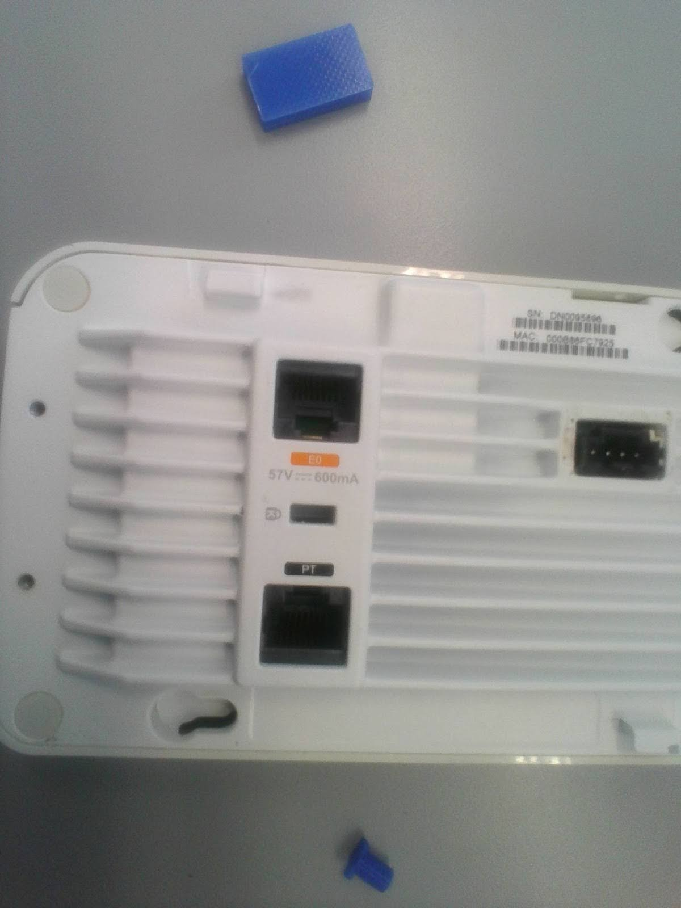

# Soporte de pared para Aruba 205H AP
---

<a href="/aruba/sm/es/" class="button"> Lee la versión resumida aquí</a>

---

## El problema
Este fue mi primer "gran" proyecto. Me encargaron crear soportes de pared nuevos y mejorados para los puntos de acceso WiFi de mi colegio, que eran 52 en total, distribuidos por toda la instalación.
Los soportes de pared originales no se usaban como el fabricante los había diseñado, ya estaban hechos para que los cables pasaran desde el interior de la pared directamente hasta el punto de acceso (AP), pero el que instaló el sistema decidió acoplar dos de estos soportes de pared entre sí y hacer un agujero por el lateral, por donde pasan los cables (Ethernet POE, con conectores RJ45).
Estos puntos de acceso se calientan mucho, ya que funcionan sin parar, y debido a esto, los soportes de plástico se hicieron frágiles y empezaron a romperse. En el momento en que comencé a trabajar en este proyecto, 10 de los 52 puntos de acceso (~19.2%) tenían soportes rotos, y a un ritmo de 4 soportes de pared rotos cada año (~7.7%, según datos proporcionados por el colegio), esperábamos tener que reemplazarlos todos tarde o temprano. Intentamos comprar los soportes de pared originales, pero como ya no se fabrican, y el único lugar que todavía los vendía los ofrecía a 8€ por pieza, decidimos tomar el asunto en nuestras propias manos y buscar una alternativa.
(A la hora de escribir este post, encontré este diseño del soporte orignial creado por <a href="https://www.thingiverse.com/thing:4947236" target="_blank" rel="noopener noreferrer">fsweetser</a>)

## Mi solución
Usé el CAD Fusion 360 para modelar el nuevo soporte de pared, que debía incluir las siguientes características:
- Base más grande y ancha: para dar espacio a los cables que deben pasar del lateral al interior del soporte, ya que el AP tiene sus conectores en la parte trasera, mirando hacia la pared.
- Capacidad de refrigeración mejorada: a través de ventilaciones en los laterales, parte superior e inferior del soporte, para evitar que el plástico se vuelva quebradizo.
- Conectores originales: para un ajuste casi perfecto con el AP.
- Orificios para tornillos en la posición original: para no tener que perforar nuevos agujeros en las paredes.
- Otras características: Una flecha direccional grabada en el soporte para indicar cuál es la parte superior, de manera que no se instale al revés accidentalmente; y un agujero en el costado para adaptar los cables al diseño del AP.

Dado que Fusion 360 es un CAD de diseño paramétrico, comencé diseñando el cuerpo del soporte y dejé los conectores para después.
Primero, incluí las ventilaciones en los laterales, con diagonales cruzadas para mejor integridad estructural, y las de la parte superior e inferior, que no fueron cruzadas porque lo consideré innecesario en esos lados.
Luego, hice dos agujeros cuadrados en ambos costados del soporte para que el conector RJ45 pudiera pasar hacia el AP.
Más adelante, añadí los orificios para los tornillos, y les hice un reborde interno para acomodar el tipo de cabeza de los que estábamos usando para fijarlos a la pared. Después, diseñé los conectores mediante ingeniería inversa a partir de muchas mediciones.
Finalmente, vacié las áreas que no aportaban a la integridad estructural del soporte para ahorrar material.

Para probar el diseño, primero imprimí en 3D varias iteraciones de los conectores hasta que encajaron perfectamente.

V1:

V2: 

 

Lo siguiente que hice fue imprimir dos placas frontales para verificar la alineación de los conectores. En la primera, tuve que recortar la zona cuadrada porque no tuve en cuenta este hueco en el diseño inicial.

 

Por último, imprimí un prototipo completo en PLA, utilizando la Ender 5 del colegio.

(Insertar imagen del producto final)

Aquí hay algunas fotos del diseño dentro de Fusion 360 y el dibujo técnico que realicé (este es de una versión más vieja) para una presentación al director del colegio, en la que obtuve la aprobación para continuar con el proyecto.

El diseño ha pasado por varias pequeñas revisiones (17 para ser exactos), aunque la filosofía del diseño ha segido igual. Actualmente hemos cambiado a ASA en lugar de PLA, ya que los primeros prototipos instalados empezaron a derretirse en el primer mes de uso. El ASA tiene una temperatura de fusión más alta, lo cual es ideal para este proyecto. Además, hemos cambiado nuestra impresora 3D por la Bambulab X1 Carbon, lo que ha resultado en una mejora significante en la calidad de las impresiones y menos fallos de impresión.

---

# Descargas
Quería hacer este proyecto open-source para que cualquier institución con el mismo problema pueda saltarse la parte de diseño y ajustes, e ir directamente a la impresión y reemplazo de los soportes de pared.
Aquí incluyo las descargas para el archivo **STL** (directo a la impresión 3D) y el archivo de Fusion 360 (para modificaciones adicionales).

<a href="../assets/aruba/Aruba_205H_wall_support.stl" class="button" download>Descarga el STL</a>

<a href="../assets/aruba/Aruba_205H_wall_support.f3d" class="button" download>Descarga el archivo de Fusion 360</a>

_© 2024. Este trabajo está licenciado abiertamente via <a href="https://creativecommons.org/licenses/by-nc-sa/4.0/deed.es" target="_blank" rel="noopener noreferrer">CC BY-NC-SA 4.0</a>_
