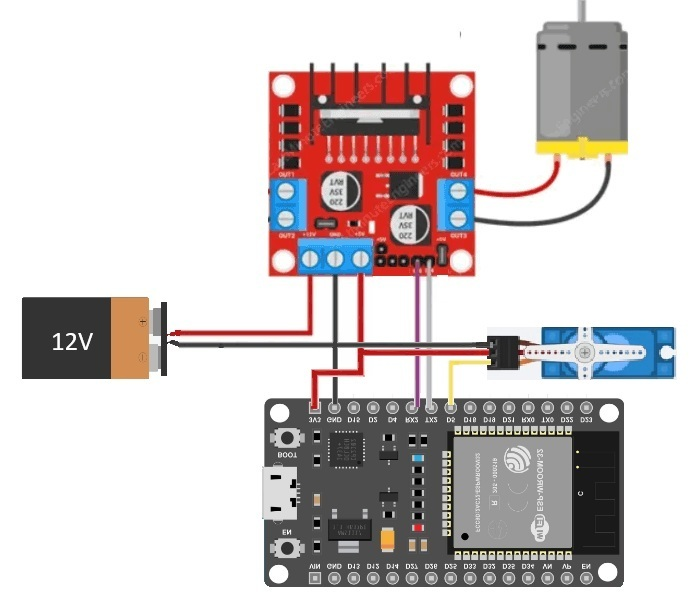

# Coche RC Impreso en 3D

---

## Idea inicial
Quería crear un coche RC de drift desde cero por mi cuenta. El objetivo era construir un coche RC barato, ya que me parecía más económico que comprar uno en AliExpress (aunque la batería sola terminó costando casi lo mismo que un coche RC de drift completo). Al final, este proyecto resultó ser una manera divertida de aprender a programar un ESP32, crear una red WiFi local, controlar un microcontrolador desde mi teléfono y mejorar mis habilidades en impresión 3D. Usé esta guía de <a href="https://dukedoks.com/portfolio/guia-chasis-rc/" target="_blank" rel="noopener noreferrer">DukeDoks</a> para imprimir y montar el chasis, y diseñé y construí el circuito electrónico por mi cuenta.

---

## Esquemas de circuito eléctrico
La idea era crear un circuito desde cero, controlado por un ESP32, usando PWM para controlar el motor DC de 12V. Como no tenía el transistor adecuado para hacerlo, finalmente opté por controlar el motor DC usando un <a href="https://spurqlabs.com/controlling-dc-motors-with-arduino-using-the-l298n-motor-driver-for-iot-automation/" target="_blank" rel="noopener noreferrer">módulo L298N</a>. El código para la red WiFi y el servo fue realizado por <a href="https://remotexy.com/en/editor/" target="_blank" rel="noopener noreferrer">Remote XY</a>.

Diagrama:

Código: _Incompleto_

---

## Resultado final
*Este proyecto aún está incompleto, por lo que no puedo mostrar ningún progreso final.*

---

## Proyecto secundario (Palier)
Mi primo, que tiene un RC, rompió ambos ejes delanteros y me pidió que los reparara. Usando Fusion 360, diseñé e imprimí en 3D algunas piezas de reemplazo, las cuales fueron diseñadas para ensamblarse usando solo 3 piezas y un clip cortado.

 