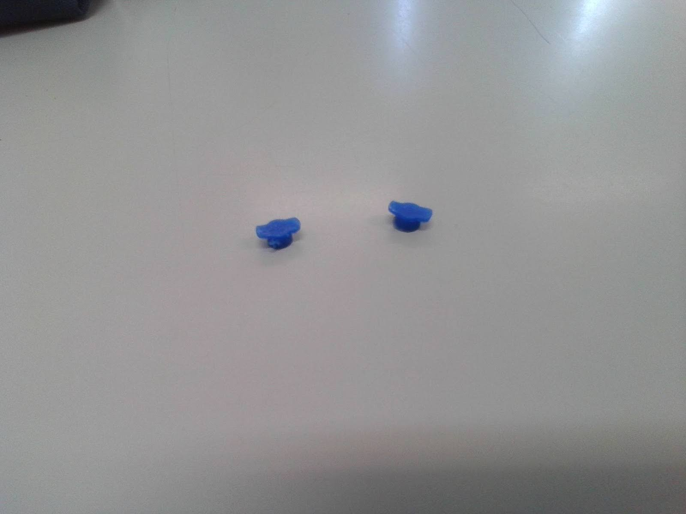
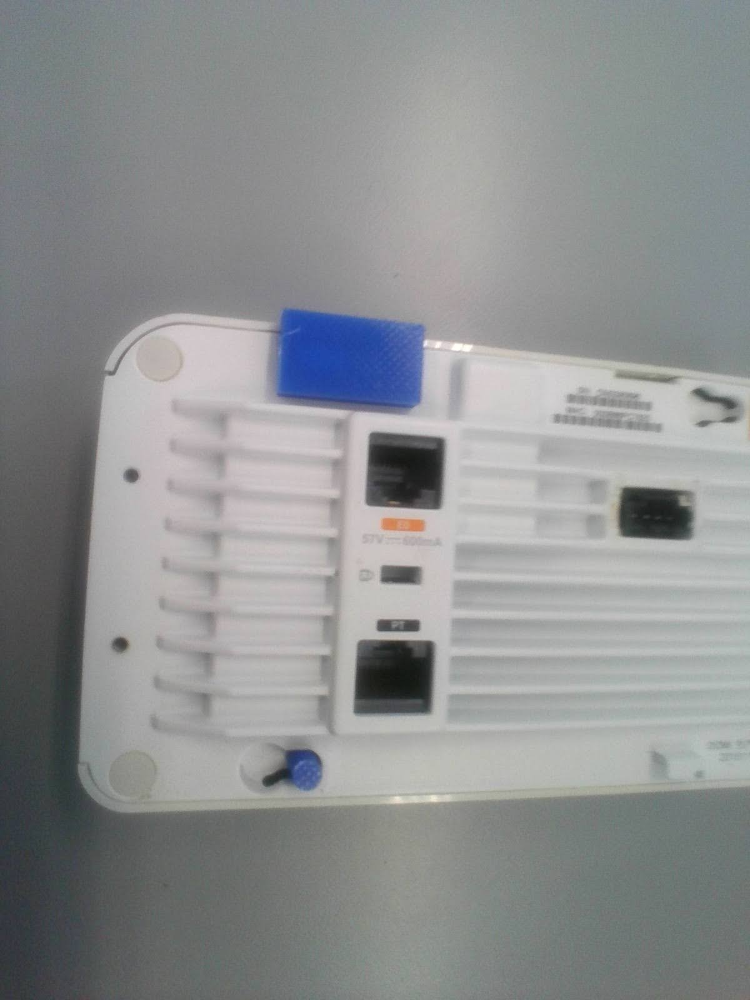

# Soporte de pared para Aruba 205H AP
---

<a href="/aruba/es/" class="button"> Lee la versión desarrollada aquí</a>

---

## El problema:
Se me encargaron crear soportes de pared mejorados para 52 puntos de acceso WiFi Aruba 205H en mi colegio. El plástico de los soportes originales se había vuelto frágil por el sobrecalentamiento de los puntos de acceso, por lo que debían ser reemplazados antes de que todos se rompieran. Cuando empezé, 10 soportes (~19.2%) ya se habían roto, con una tasa de fallo de aproximadamente ~7.7% anual. Ya que los reemplazos estaban descatalogados y eran caros (8€ cada uno), decidimos diseñar los nuestros propios.
(Echa un vistazo a este diseño de <a href="https://www.thingiverse.com/thing:4947236" target="_blank" rel="noopener noreferrer">fsweetser</a>)

## Mi solución:
Utilizando Fusion 360, modelé un nuevo soporte con:
- Base más grande y amplia para el enrutamiento lateral de cables.
- Capacidad de refrigeración mejorada a través de ventilaciones en los lados.
- Conectores originales para un ajuste casi perfecto con el AP.
- Agujeros para tornillos en la posición original.
- Detalles adicionales como una flecha de orientación y un orificio lateral.

Iteré a través de varios prototipos, empezando con los conectores:

V1:

V2:

 

Luego, probé la alineación de los conectores con estas placas:

 

Finalmente, imprimí un prototipo completo en PLA en la Ender 5 del colegio.

(Insertar imagen del producto final)

Aquí se muestran las vistas previas en Fusion 360 y un dibujo técnico inicial:

El diseño ha pasado por 17 pequeñas revisiones. Cambiamos de PLA a ASA (mejor resistencia al calor) y actualizamos a una Bambulab X1 Carbon para mejorar la calidad.

---

# Descargas
Este proyecto
This project is open-source so others can print or modify it directly.

<a href="../../assets/aruba/Aruba_205H_wall_support.stl" class="button" download> STL Download </a>

<a href="../../assets/aruba/Aruba_205H_wall_support.f3d" class="button" download> Fusion 360 file Download </a>

_© 2024. This work is openly licensed via <a href="https://creativecommons.org/licenses/by-nc-sa/4.0/" target="_blank" rel="noopener noreferrer">CC BY-NC-SA 4.0</a>_