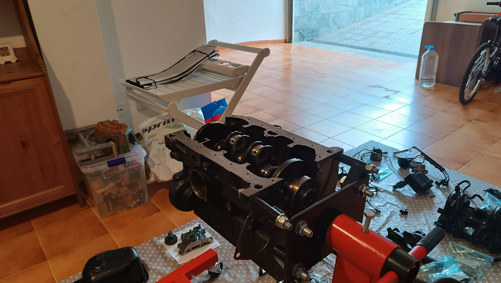
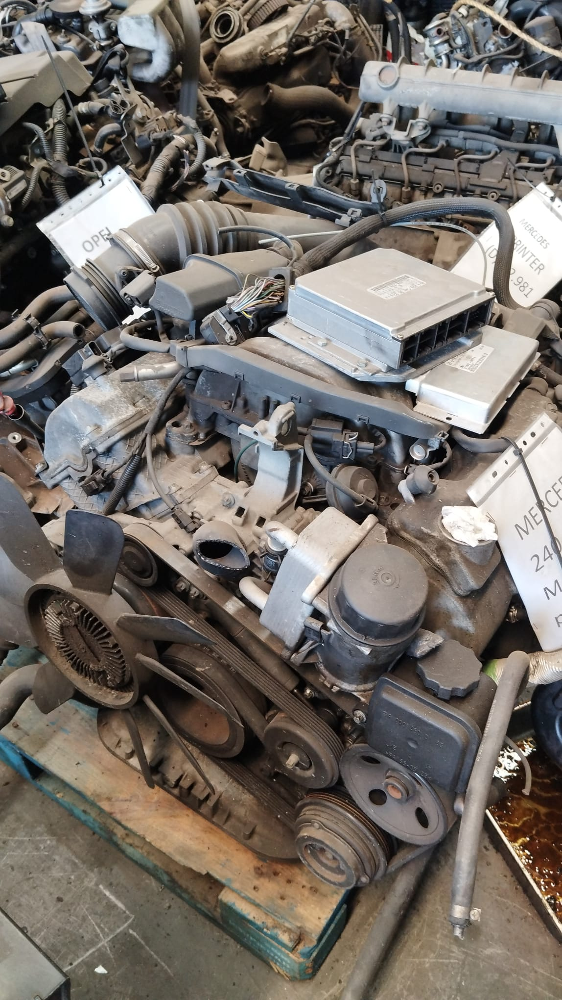
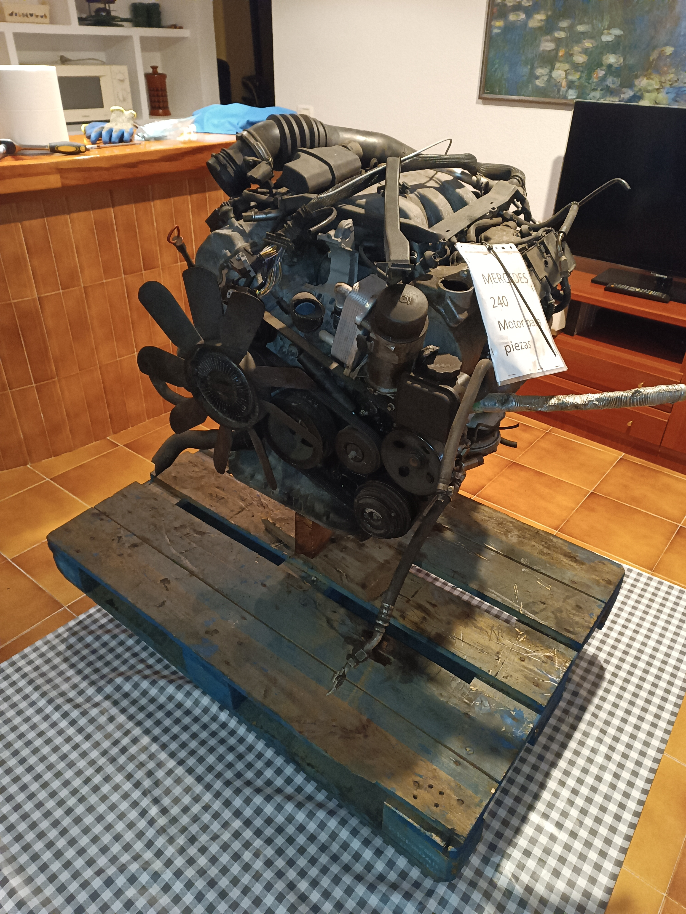

# Revisión y despiece de motores
---

<a href="/engines/es/" class="button"> Lee la versión desarrollada aquí</a>

---

## Cómo me metí en el mundo de los motores
Soy un apasionado de los coches, especialmente de los motores de combustión. Como no podía permitirme ni guardar un coche de proyecto, empecé a trabajar directamente con motores. Con un juego básico de herramientas y un soporte de motor barato, aprendí mucho sobre el diseño y cómo rearmar motores. Canales de YouTube como <a href="https://www.youtube.com/@Donut" target="_blank" rel="noopener noreferrer">Donut</a>, <a href="https://www.youtube.com/@chrisfix" target="_blank" rel="noopener noreferrer">ChrisFix</a>, <a href="https://www.youtube.com/@RobDahm" target="_blank" rel="noopener noreferrer">Rob Dahm</a>, <a href="https://www.youtube.com/@d4a" target="_blank" rel="noopener noreferrer">driving 4 answers</a>, <a href="https://www.youtube.com/@EngineeringExplained" target="_blank" rel="noopener noreferrer">Engineering Explained</a> y <a href="https://www.youtube.com/@AngeTheGreat" target="_blank" rel="noopener noreferrer">AngeTheGreat</a> me inspiraron a empezar.
Hasta ahora he rearmado un motor y desarmado otro.

---

## Volkswagen 6N1
El primer motor que rearmé: un 4 cilindros de 1.4L, 8v SOHC, de un VW Polo Mk3. Estaba incompleto y en mal estado (faltaban piezas, juntas rotas, tornillos cambiados por otros distintos), así que no lo hice funcionar, pero fue perfecto para aprender a rearmar un motor.

  

---

## Mercedes-Benz M112
Un V6 SOHC de 2.4L con 3 válvulas y 2 bujías por cilindro. Se veía bien aparte de un agujero en el cárter, y de que faltaban el volante de inercia y la tapa de aceite. Empecé a desarmarlo, pero necesitaba herramientas específicas de Mercedes para las culatas y la cadena de distribución, así que volví a armar las piezas en buen estado y lo devolví al desguace.

 

---

## Revisión de una caja manual
Sabía más o menos cómo funcionaban las transmisiones manuales, pero había cosas que no entendía del todo, como el funcionamiento de los sincronizadores. Tenía una idea general, pero los detalles no estaban claros. Por eso decidí rearmar una caja de cambios manual de 5 velocidades de un Seat 127. El proceso resultó sorprendentemente fácil y fluido, y me ayudó a entender mucho mejor esas piezas. Fue muy satisfactorio ver todo armado y funcionando como debe.

 

---

## Simulador de motores
Hice el motor del Mazda MX-5 NA para el simulador de motores de <a href="https://www.youtube.com/@AngeTheGreat" target="_blank" rel="noopener noreferrer">AngeTheGreat</a>, ya que no existía ninguno. Después de programarlo y ajustar los parámetros con ayuda de la comunidad, lo subí a <a href="https://catalog.engine-sim.parts/parts/852" rel="noopener noreferrer">engine-sim.parts</a>.