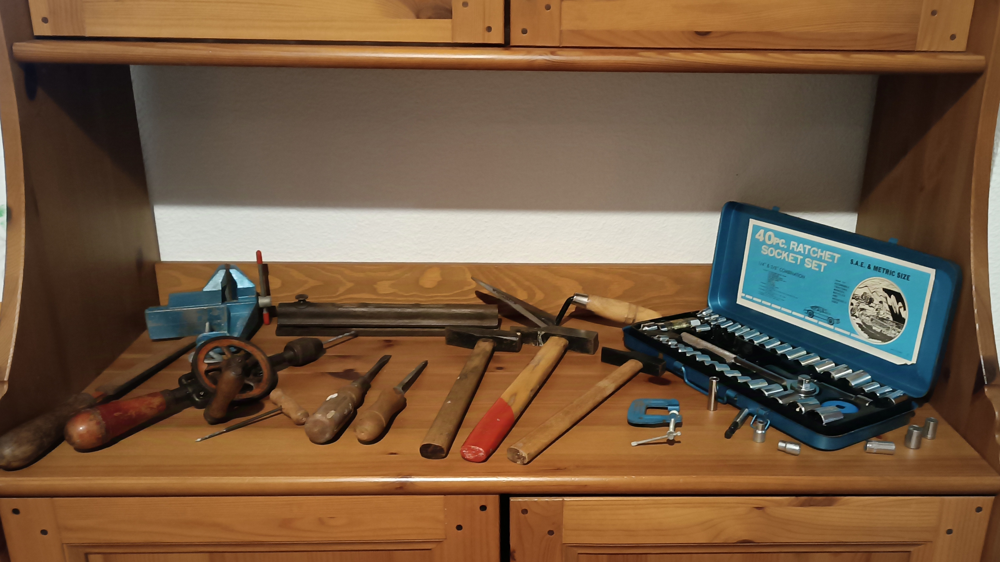
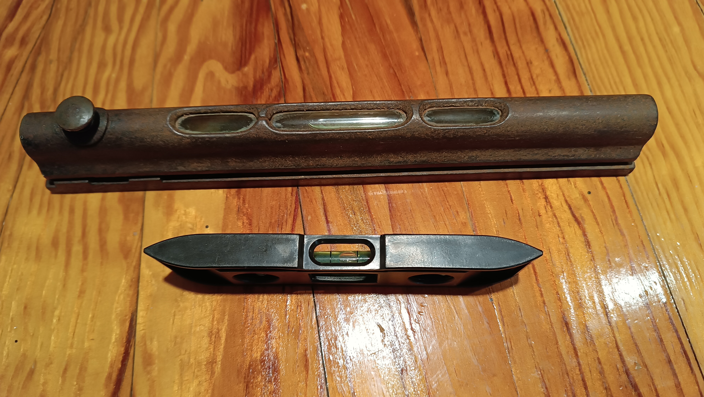

# About Me
Hello there,
Currently I'm a student trying to make it to a mechanical engineering university, although I've already done some small simple proyects as a hobby (and some of them as a special order from my school!). Here are some personal thougths and other stuff.

---

## My opinion about "electrification"
Complex issues like transport decarbonization are rarely solved by a single, all-or-nothing policy, and that is why eFuels are emerging as a necessary and sensible part of the future of mobility. Depending entirely on electric vehicles risks placing our faith in an immature technology, a strategy that history shows can backfire, as seen in the early 2000s, when EU legislation and regulation strongly favored towards diesel passenger vehicles. In less than 2 decades it became obvious how this legislation ultimately failed and how diesels were not quite as environmentally and CO₂ friendly than initial research led us to believe.

Synthetic, liquid eFuels are produced using hydrogen from renewable energy and CO₂, which can be filtered directly from the air using technology like <a href="https://newsroom.porsche.com/en/2023/sustainability/porsche-direct-air-capture-iaa-fighting-climate-change-with-important-new-technology-33646.html" target="_blank" rel="noopener noreferrer">Direct Air Capture (DAC)</a>. This technology is considered important for the future of energy extraction and climate action. This CO₂ can be extracted wherever renewable energy is available to power the process, and the technology is scalable. By using eFuels, existing internal combustion engine (ICE) vehicles, of which there will still be many on the road worldwide for decades, can be operated in a nearly carbon-neutral way. This means eFuels offer a path to factor older vehicles into the decarbonization effort. In their core properties, these fuels are no different than petrol or diesel made from crude oil, which makes them easy to distribute using existing infrastructure. We are already seeing this happen; Porsche and its partners have produced synthetic fuel industrially in Chile since late 2022, leveraging the strong local wind energy to produce eFuels.

If we enforce a rapid shift only to battery electric vehicles (EVs), we risk trading the current climate problem for two new ones: electricity that isn't as clean as advertised, and a massive amount of waste. Although EVs have many benefits, the technology is still immature compared to over a century of development poured into combustion technology. Also, battery production itself creates huge environmental damage before the vehicle even hits the road. For example, the manufacturing process (especially the energy used in the assembly stage) is an important part of the total greenhouse gas effects, contributing between 45% and 60% of the production impact. This is why the electricity mix of the production location greatly affects the total result. Despite emissions, lithium-ion batteries create safety hazards, as if they fail, the stored energy can release nearly instantly, causing severe heating that couldd lead to a fire or an explosion. Putting out these fires in vehicle batteries, which contain thousands of cells, is extremely difficult, sometimes requiring the entire pack to be submerged in water, which is often nearly impossible for the larger ones. The failure rate is considered "very rare," since it's reported as one fire for every million batteries. In the standards of engineering, this rate is considered a "good system", but taking into account the millions of vehicles which would have to be replaced, the risk grows exponentially.

This brings us to recycling these batteries. Currently, there is no market for refurbished or "second life" vehicle batteries, which means the entire environmental impact of the battery's production falls on the vehicle itself. Recycling lithium-ion batteries is technically hard, but the biggest issue is often economic. For instance, battery types like Lithium Iron Phosphate (LFP) lack economically valuable metals like cobalt or nickel, which typically drive the commercial recycling process, meaning there is little incentive to recover other important materials like aluminium or lithium. The recovered materials are generally not of "battery grade," meaning they cannot be reused in new batteries and must be broken down to elements, adding more steps and costs to the process. 

Because of these manufacturing issues, safety concerns, and the difficulty of material recovery, eFuels provide a strong alternative to this problem. They offer an immediate, workable solution for decarbonizing the transport fleet that exists today and for those vehicles, like ships and planes, where batteries simply aren't a practical solution right now. By supporting both electric options and sustainable liquid fuels, we adopt the organic and sensible transition that is necessary for long-term sustainability. Therefore, battery powered vehicles should not be seen as a replacement for the current system; rather, they should be viewed as an alternative.

---

## Old tool collection
One afternoon, my grandfather showed me his collection of old tools and told me that he wanted me to keep them, explaining that some of them go back as far as four generations before me, which makes them a fascinating and meaningful piece of family history I'm proud to take on.

 

 
