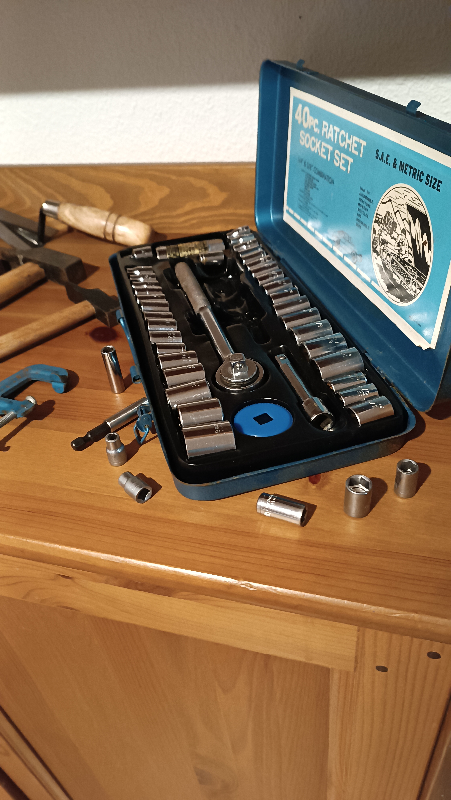
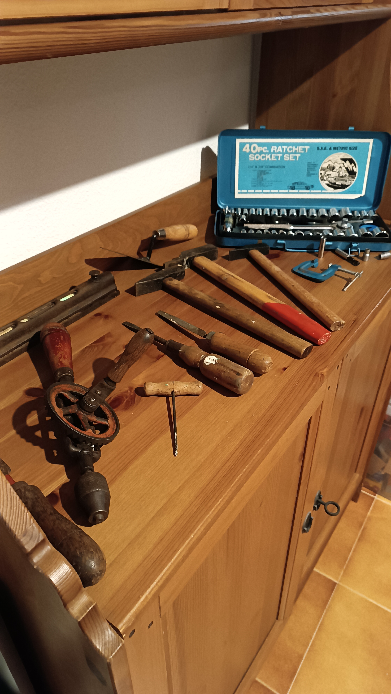
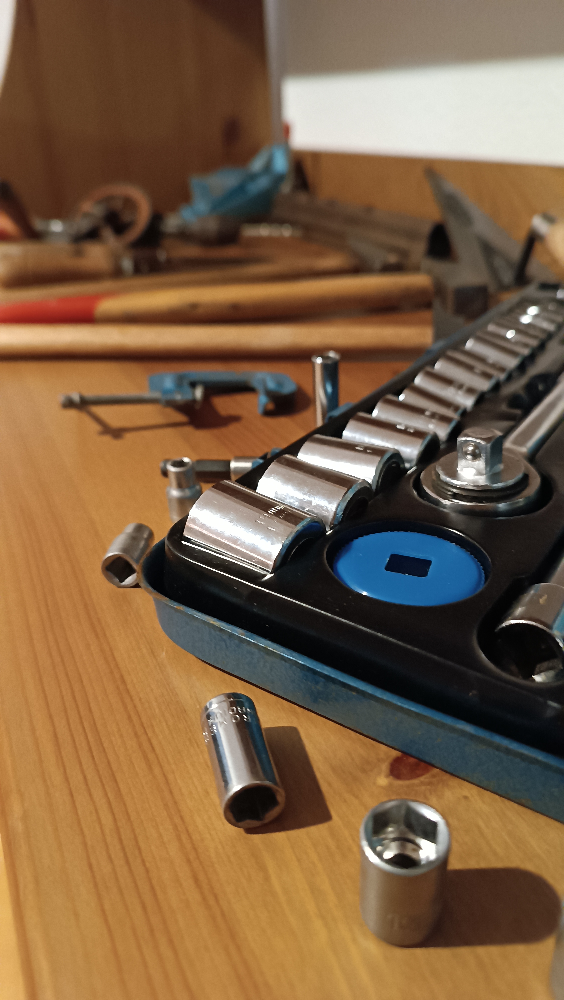
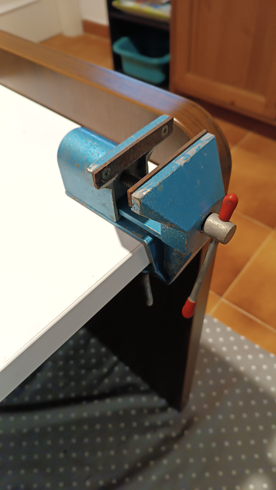

# About Me
Hello there,
Currently I'm a student trying to make it to a mechanical engineering university, although I've already done some small simple proyects as a hobby (and some of them as a special order from my school!). Here are some personal thougths and other stuff.

---

## Old tool collection
One afternoon, my grandfather showed me his collection of old tools and told me that he wanted me to keep them, explaining that some of them go back as far as four generations before me, which makes them a fascinating and meaningful piece of family history I'm proud to take on.

 

 

---
title: "About me"
permalink: /about/
---
