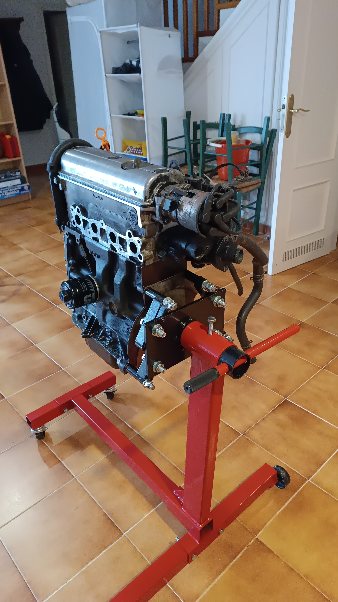
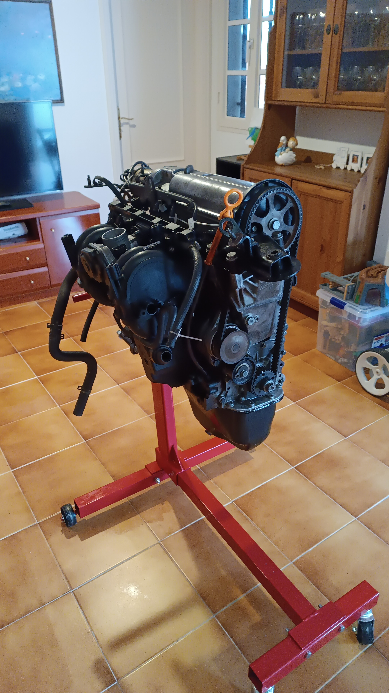
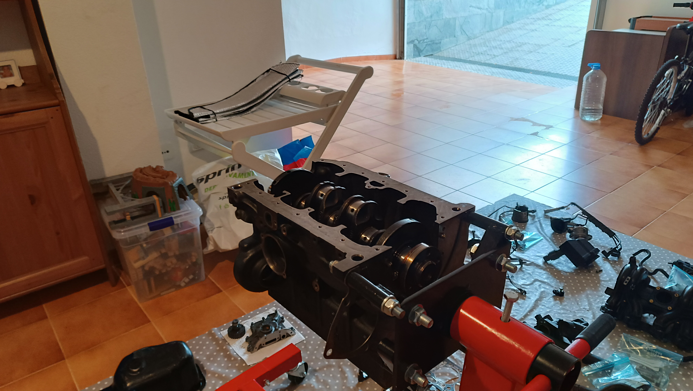
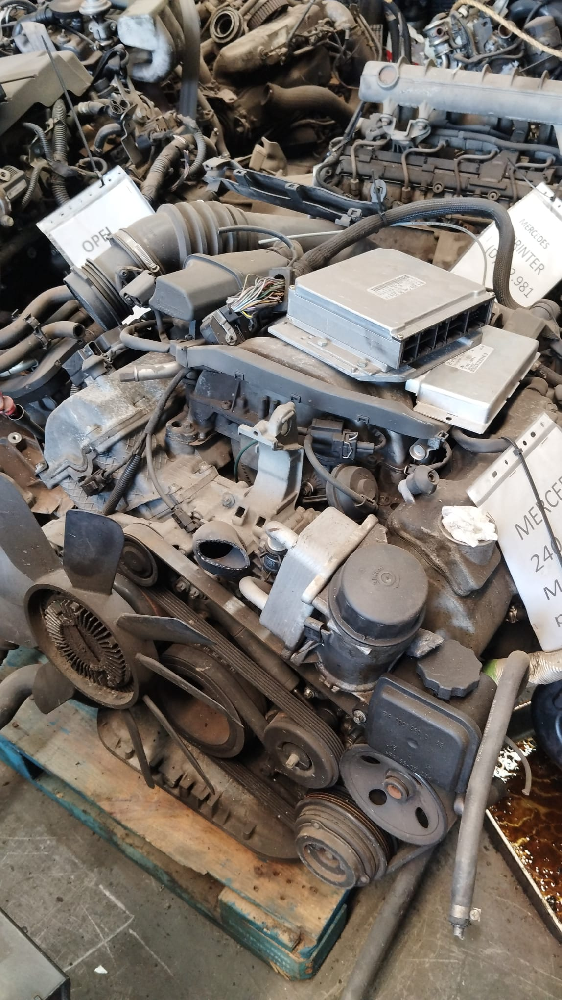
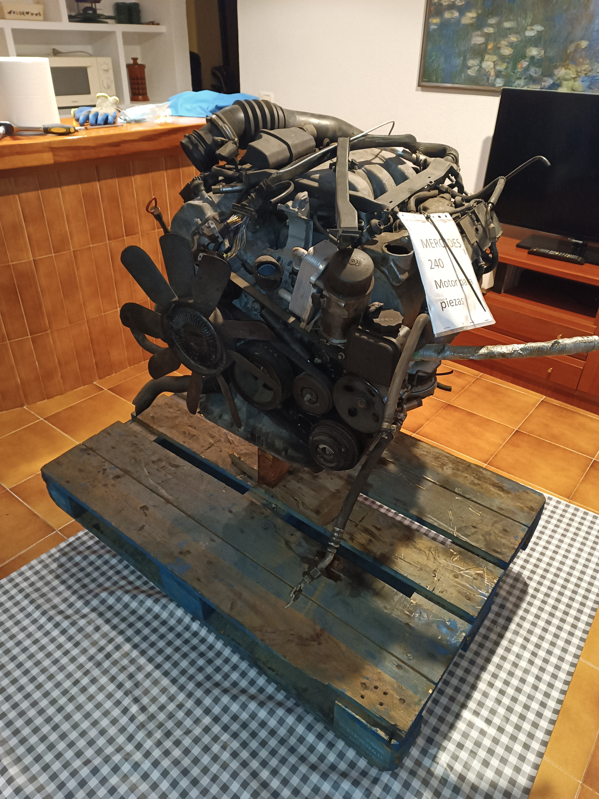
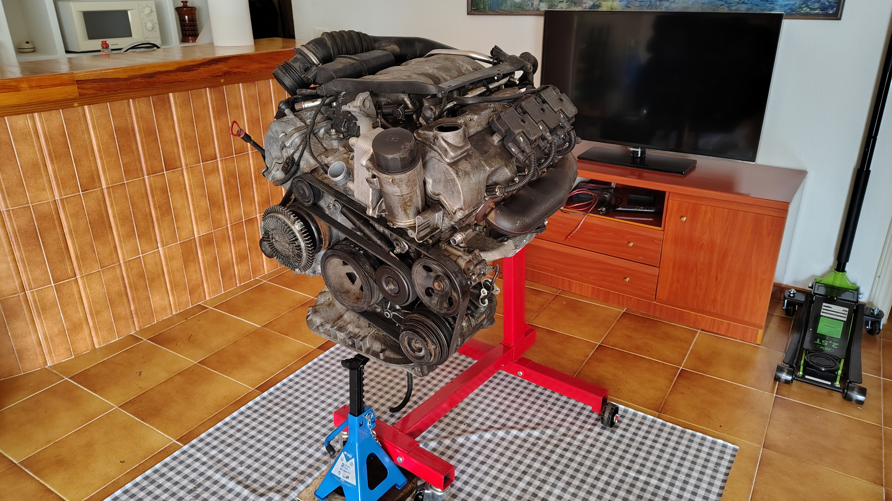
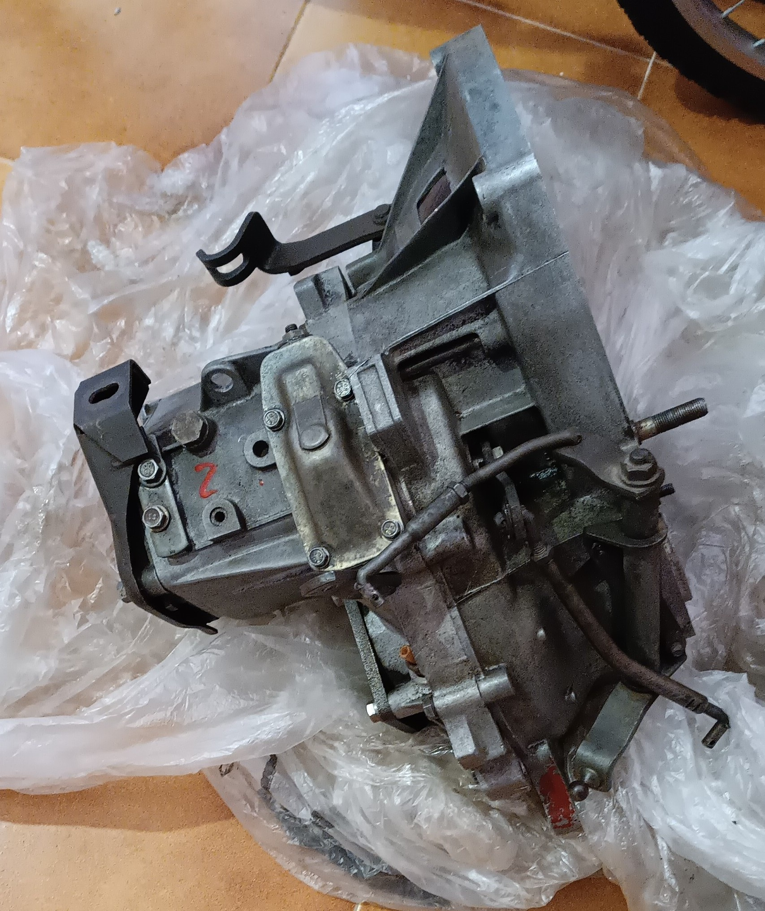
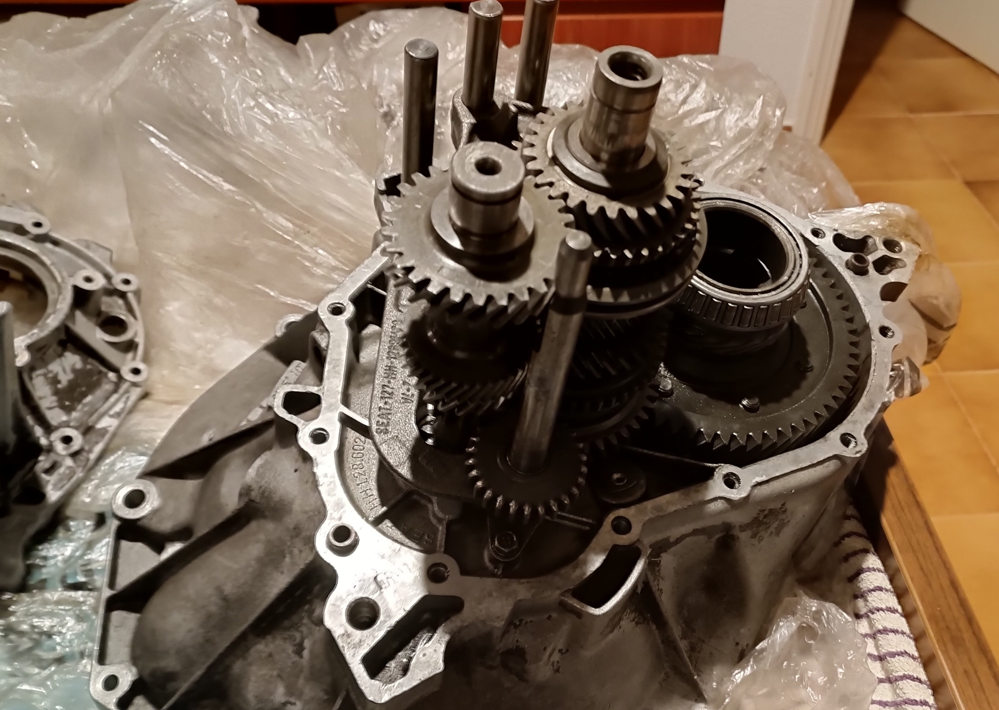

# Engine rebuilds and teardowns
---

<a href="/engines/sm/" class="button"> Read the summarized version here</a>

---

## How I Got Into Engines
You could say I'm a car enthusiast, especially when it comes to internal combustion engines.
I wanted to have an old car I could fix and modify, a project car, but my basement didn’t have enough space to work on a car comfortably, and I didn't have the funds. So I had to stick to something smaller and cheaper: engines.
I bought a cheap engine stand and I was gifted a basic set of tools, which to be honest is the best way to get started on wrenching on cars. You get to understand every single part, from the main rotating assemblies to the little quirks and features of each individual engine, as well as the manufacturing processes and philosophy each brand takes on. Although I already kind of knew almost everything there is to know about an average street car engine thanks to YouTube videos from <a href="https://www.youtube.com/@Donut" target="_blank" rel="noopener noreferrer">Donut</a>, <a href="https://www.youtube.com/@chrisfix" target="_blank" rel="noopener noreferrer">ChrisFix</a>, <a href="https://www.youtube.com/@RobDahm" target="_blank" rel="noopener noreferrer">Rob Dahm</a> (the absolute legend when it comes to rotary engines), <a href="https://www.youtube.com/@d4a" target="_blank" rel="noopener noreferrer">driving 4 answers</a>, <a href="https://www.youtube.com/@EngineeringExplained" target="_blank" rel="noopener noreferrer">Engineering Explained</a>, and <a href="https://www.youtube.com/@AngeTheGreat" target="_blank" rel="noopener noreferrer">AngeTheGreat</a> (and his cool 2D engine simulator). Honorable mentions go to <a href="https://www.youtube.com/@NIGHTRIDEPL" target="_blank" rel="noopener noreferrer">Nightride</a>, <a href="https://www.youtube.com/@stanceworks" target="_blank" rel="noopener noreferrer">StanceWorks</a>, <a href="https://www.youtube.com/@GearsandGasoline" target="_blank" rel="noopener noreferrer">Gears and Gasoline</a>, <a href="https://www.youtube.com/@throtl" target="_blank" rel="noopener noreferrer">throtl</a>, and <a href="https://www.youtube.com/@RonaldFinger" target="_blank" rel="noopener noreferrer">Ronald Finger</a>, which have been great inspiration for taking on projects like these and for eventually wanting to restore and modify a car.

Up to this point I have rebuilt one engine, and torn down the exterior of another one. Keep reading to see how that went.

---

## Volkswagen 6N1
This was the first engine I've ever rebuilt. It's a 1.4 liter, 8 valve SOHC, 4 cylinder that you can find in Mk3 VW Polos. It's a really easy engine to work on, as everything is easy to access, and doesn't require specialized tools, except for the head bolt socket, which I had to borrow twice from a mechanic. I got this engine as a gift from a friend of my father, and it wasn't in it's greatest shape: it didn't come with a flywheel, a starter motor, the wiring harness, or the ECU. On top of that, this engine was used at a professional formation school, so it had been rebuilt before, but not very well: some bolts and nuts had been replaced with random ones, most piston rings were missing, seals were broken, and the overall condition of the engine wasn't great. I could've spent around 200€ to 300€ replacing everything that was broken with a mix of junkyard and new parts to make it run, but I didn't want to spend that kind of money on an engine I knew would go to the junkyard anyway. In conclusion, this little 4 cylinder is great when it comes to learning how to rebuild an engine.

  

---

## Mercedes-Benz M112
I couldn't rebuild this second engine. It's a 2.4 liter, 18 valve SOHC V6, with 3 valves and 2 spark plugs per cylinder. I really don't know what Mercedes' engineers were thinking when designing this engine, but they made wild choices for sure. The plan for this engine was to try to rebuild it and run it, since it didn't seem to be in that bad condition even though the junkyard which donated the engine listed it as "for parts". The only visual damage that the engine had was a hole in the oil pan (which could've been caused by transport), no flywheel, and no oil cap, but other than that the engine seemed fine; I even had the wiring loom and the ECU. When I got the engine mounted to my engine stand, it was so heavy it leant forwards, so I had to use a pallet and two chunks of wood to keep it straight; which I ended up changing later for a car jack stand for greater safety. I was pretty confident in my skills as a mechanic, and started to tear down the engine, which could've been faster if I hadn't had to buy a Torx set (Germans love Torx for whatever reason), but at least I won’t ever have to be bothered about not having Torx again. Everything went well up until the next step was lifting the heads off the block, as I needed some specialized tools from Mercedes that I couldn't borrow from anyone for the timing chain and the camshaft removal. I took the same approach as with the VW engine, I didn't want to spend money on an engine that would go back to the junkyard anyway. I ended up putting everything that wasn't broken together and returning the engine.

 

--- 

## Manual transmission rebuild
I kind of knew how manual transmissions work, but there were some things that I didn't completely comprehend, like how the synchros worked. I had a general idea, but the details weren't clear to me. As a result, I decided to rebuild a 5-speed manual transmission from a Seat 127. The process went surprisingly easy and smooth, and it helped me understand those parts much better. It was satisfying to see everything come together and work as it should.

 

---

## Engine Simulator
I became obsessed with <a href="https://www.youtube.com/@AngeTheGreat" target="_blank" rel="noopener noreferrer">AngeTheGreat</a>'s Engine Simulator, and messing around with community-made engines, I couldn't find anyone who had made a proper representation of the Mazda MX-5 NA engine. So I decided to try to code it myself, it couldn't be so difficult, could it? (It kind of was, since I couldn't find any tutorials on how to code an engine on this simulator) Why the MX-5? Well, I just really like the car, and I wanted it to be my project car before they got outrageously expensive.
When I finished coding it (with some help from some people on the Engine Sim Discord), and tweaked the engine's parameters and values I found online. Happy with the end result, I posted the engine to AngeTheGreat's Engine Sim website, <a href="https://catalog.engine-sim.parts/parts/852" rel="noopener noreferrer">engine-sim.parts</a>, where you can download it.