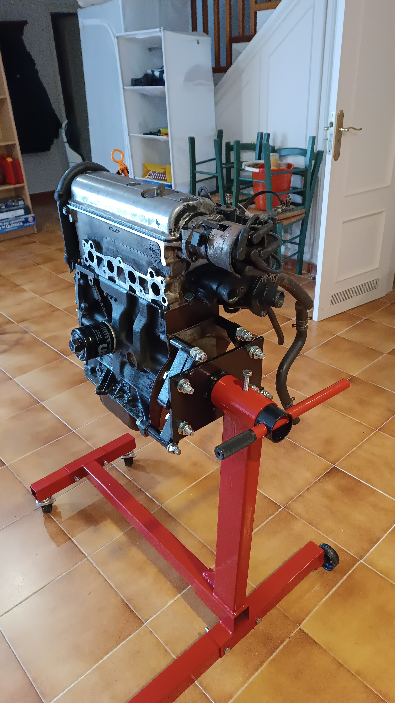

# Engine rebuilds and teardowns
---

<a href="/engines/" class="button"> Read the extended version here</a>

---

## How I Got Into Engines
I’m a car enthusiast, and I'm especially into internal combustion engines. Since I couldn’t afford or store a project car, I started working on engines instead. With a basic tool set and a cheap engine stand, I learned a lot about engine design and rebuilding. YouTube channels like <a href="https://www.youtube.com/@Donut" target="_blank" rel="noopener noreferrer">Donut</a>, <a href="https://www.youtube.com/@chrisfix" target="_blank" rel="noopener noreferrer">ChrisFix</a>, <a href="https://www.youtube.com/@RobDahm" target="_blank" rel="noopener noreferrer">Rob Dahm</a>, <a href="https://www.youtube.com/@d4a" target="_blank" rel="noopener noreferrer">driving 4 answers</a>, <a href="https://www.youtube.com/@EngineeringExplained" target="_blank" rel="noopener noreferrer">Engineering Explained</a>, and <a href="https://www.youtube.com/@AngeTheGreat" target="_blank" rel="noopener noreferrer">AngeTheGreat</a> inspired me to get started.  
So far, I’ve rebuilt one engine and torn down another.

---

## Volkswagen 6N1
My first rebuild: a 1.4L 8v SOHC inline-4 from a Mk3 VW Polo. It was incomplete and in poor condition (missing parts, broken seals, random bolts), so I didn’t make it run, but it was perfect for learning how to rebuild an engine.

  

---

## Mercedes-Benz M112
A 2.4L SOHC V6 with 3 valves and 2 spark plugs per cylinder. It looked fine apart from a hole in the oil pan, missing flywheel, and missing oil cap. I started tearing it down, but needed Mercedes-specific tools for the heads and timing chain, so I reassembled the good parts and returned it to the junkyard.

 

--- 

## Manual transmission rebuild
I kind of knew how manual transmissions work, but there were some things that I didn't completely comprehend, like how the synchros worked. I had a general idea, but the details weren't clear to me. As a result, I decided to rebuild a 5-speed manual transmission from a Seat 127. The process went surprisingly easy and smooth, and it helped me understand those parts much better. It was satisfying to see everything come together and work as it should.

 

---

## Engine Simulator
I created a Mazda MX-5 NA engine for <a href="https://www.youtube.com/@AngeTheGreat" target="_blank" rel="noopener noreferrer">AngeTheGreat</a>’s Engine Simulator, since none existed. After coding and fine-tuning with community help, I uploaded it to <a href="https://catalog.engine-sim.parts/parts/852" rel="noopener noreferrer">engine-sim.parts</a>.
