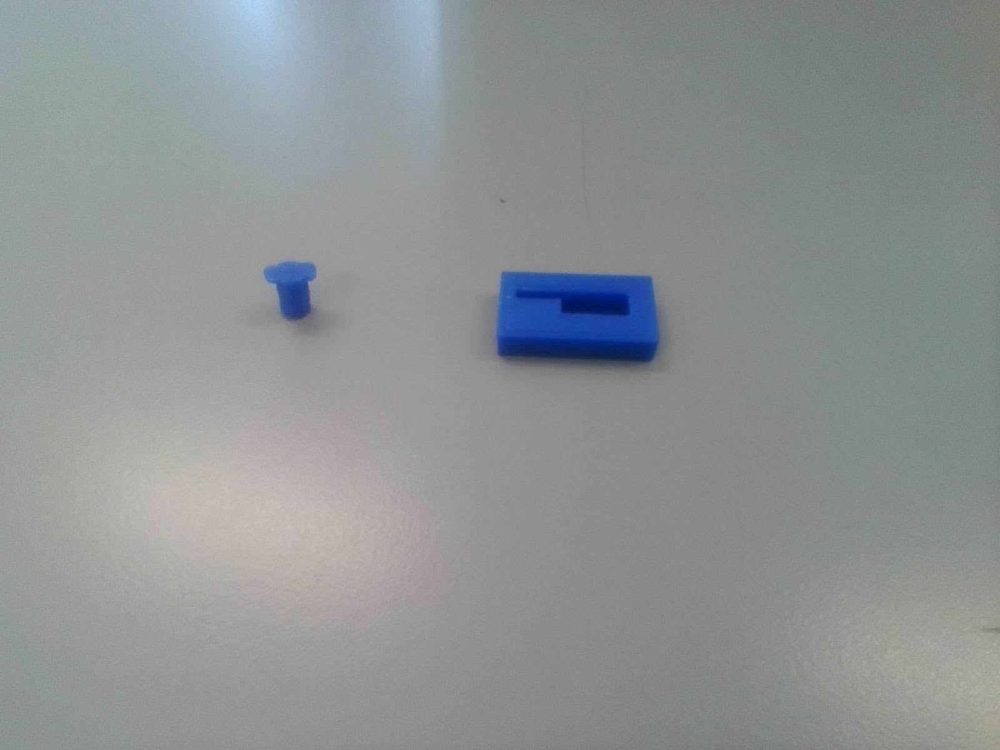
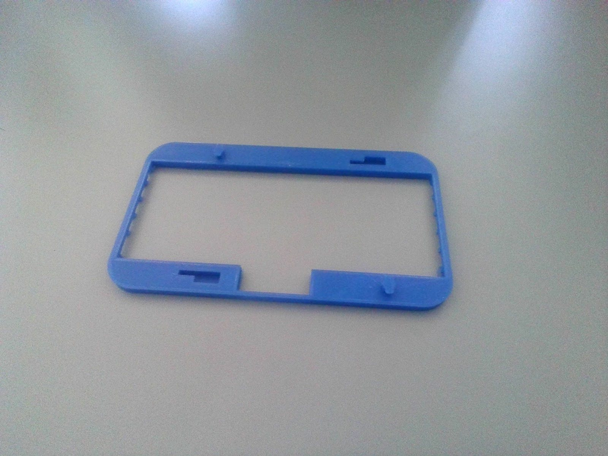
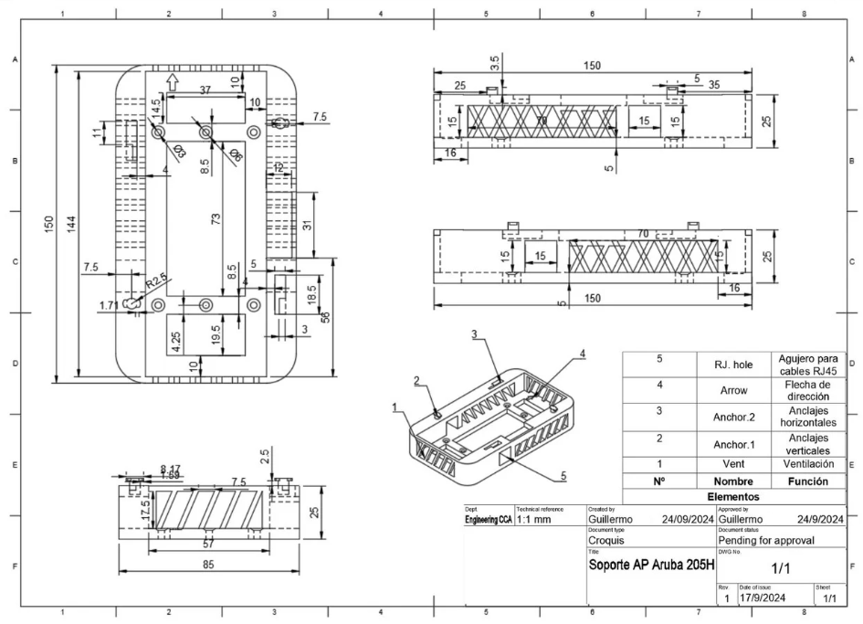

# Aruba 205H AP Wall Support
---
## The problem:
This was my first "big" project, I was commissioned to create a new and improved wall supports for my school's wifi access points, which were 52 in total, scattered throughout the facility.
The original wall supports were not used as intended by the manufacturer, as they were designed so that the cables ran from the inside of the wall directly to the AP, but the guy who installed the system decided to clamp two of these thin wall supports against each other and make a hole on the side, through which he would run the cables (Ethernet POE, with RJ45 connectors). 
These APs get very hot, as they run non-stop, and because of this the plastic wall supports have become very brittle and started to break. At the point where I started working on this project, 10 out of 52 APs (~19.2%) had broken supports, and at a rate of 4 wall supports breaking every year (~7.7%, data provided by the institution) we were expecting to replace them all sooner or later. We tried to buy the wall supports, but since they are no longer in production, and the only place that still sold them priced them at 8€ per piece, we decided to put the matter into our own hands and find an alternative. 
(At the time of writing this, I found this awesome design by <a href="https://www.thingiverse.com/thing:4947236" target="_blank" rel="noopener noreferrer">fsweetser</a> of the original mounting bracket, go check it out!)

---
## My solution:
I used my CAD of choice, Fusion 360, to model the new wall support, which had to include the following features:
- Bigger, wider footprint: to make room for the cables which have to run from the side to the inside of the support, as the AP has its connectors at the back, facing the wall.
- Improved cooling capacity: through vents on the sides, top and bottom of the support, so that the plastic doesn't become as brittle.
- Reverse engineered connectors: for a near perfect fit with the AP.
- Screw holes on stock position: so that we don't have to drill new holes on the walls.
- Other miscellaneous features: A directional arrow indented onto the support to show where the top of the wall support is, so that during installation you don't put it upside down accidentally; and a hole on the side to accommodate for the natural design of the AP.

Since Fusion 360 is a parametric design CAD, I started designing the body of the support and left the connectors for later. 
First, I included the vents on the sides, crossed for better structural integrity, and the ones at the top and bottom, which weren't crossed because I deemed it unnecessary on those sides. 
Then I made two square holes at both sides of the support so that the RJ45 connector could go through. 
Later on I accounted for the screw holes, and chamfered them inside for the head type that we were using to attach them to the wall, and designed the connectors by reverse engineering them through many measurements.
Finally, I hollowed out areas that didn’t contribute to structural integrity of the support to save up some material.

To put the design to the test, I first 3D printed several iterations of the connectors up until they clicked right.

V1:

V2: 

 

Next up, I printed two face plates to check for the alignment of the connectors, on the first one I had to trim the square area because I didn't account for it.

 

Ultimately, I printed a whole prototype on PLA, on the school's Ender 5.

(Insert image of final product)

Here are some pictures of the design inside of Fusion 360 and the technical drawing I made (this one being a bit outdated) for a presentation to the school's headteacher, in which I got approval for continuing with the project.

The design has gone through several yet small revisions (17 to be exact), although the design philosophy has remained the same. Currently we have switched to ASA instead of PLA, as the first prototypes which were installed would start to melt on the first month of use. ASA provides a higher melting temperature which is great for this project. We have also upgraded our 3D Printer to the Bambulab X1 Carbon, which has resulted in a big quality improvement and fewer print failures.

(insert image of final product here)

---
# Downloads
I wanted to make this project open-source so that any institution with the same specific problem can skip the design and tinkering part and go straight to printing and replacing the wall mounts.
Here I've included the downloads for the STL file (Straight to 3D printing) and the Fusion 360 file (For further modifications).

<a href="../assets/aruba/Aruba_205H_wall_support.stl" class="button" download> STL Download </a>

<a href="../assets/aruba/Aruba_205H_wall_support.f3d" class="button" download> Fusion 360 file Download </a>

This design is licensed under the <a href="https://www.gnu.org/licenses/gpl-3.0.en.html" target="_blank" rel="noopener noreferrer">GNU General Public License v3.0 (GPLv3)</a>
