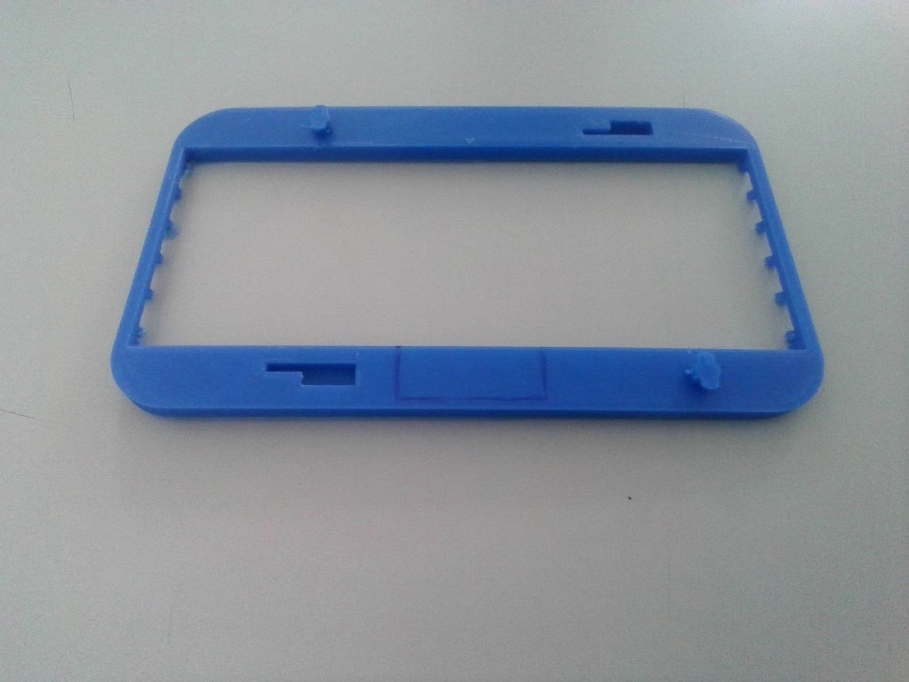
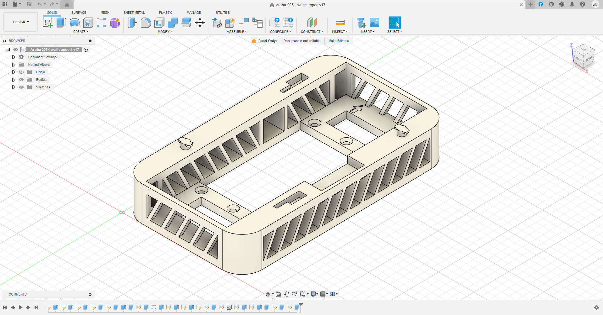

# Aruba 205H AP Wall Support
---
## The problem:
I was tasked with creating improved wall supports for 52 Aruba 205H Access Points at my school. The original supports' plastic was brittle due to the APs overheating, therefore they had to be replaced before they all break. By the time I started, 10 supports (~19.2%) had broken, with ~7.7% failing each year. Since replacements were discontinued and overpriced (8€ each), we decided to design our own.  
(Check out this design by <a href="https://www.thingiverse.com/thing:4947236" target="_blank" rel="noopener noreferrer">fsweetser</a>!)

---
## My solution:
Using Fusion 360, I modeled a new support with:
- Larger footprint for side cable routing.
- Cooling vents on all sides.
- Reverse engineered connectors for proper fit.
- Stock-position screw holes.
- Added details like an orientation arrow and side hole.

I iterated through several prototypes, starting with connector tests:

V1:

V2: 

 

Then I tested alignment with face plates:

 

Finally, I printed a full PLA prototype on the school’s Ender 5.  

(Insert image of final product)

Here are Fusion 360 previews and an early technical drawing:

The design has gone through 17 small revisions. We switched from PLA to ASA (better heat resistance) and upgraded to a Bambulab X1 Carbon for improved quality.

---
# Downloads
This project is open-source so others can print or modify it directly.

<a href="../../assets/aruba/Aruba_205H_wall_support.stl" class="button" download> STL Download </a>

<a href="../../assets/aruba/Aruba_205H_wall_support.f3d" class="button" download> Fusion 360 file Download </a>

This design is licensed under the <a href="https://www.gnu.org/licenses/gpl-3.0.en.html" target="_blank" rel="noopener noreferrer">GNU General Public License v3.0 (GPLv3)</a>
